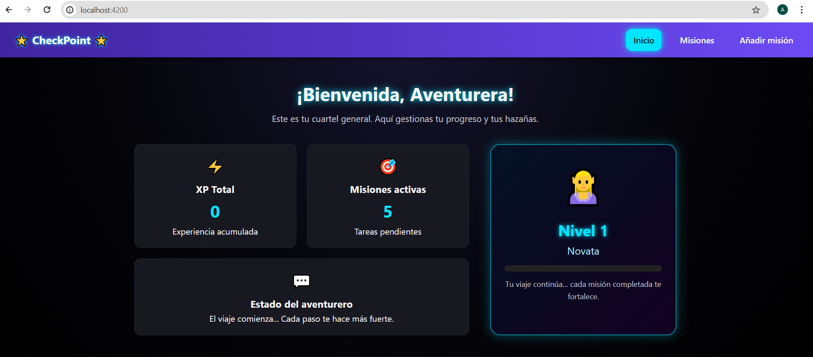
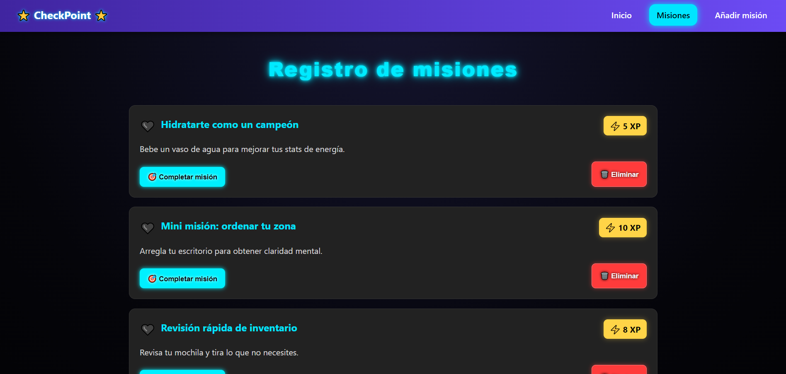
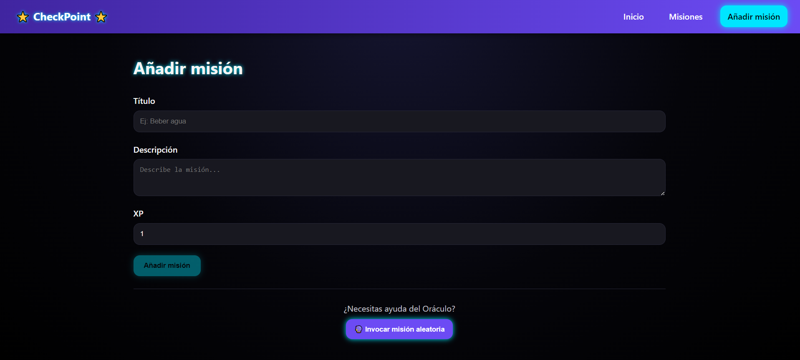

VERSIÓN ESTABLE DEL PROYECTO EN DESARROLLO. -> DESARROLLO EN DEVELOP.

# CheckPoint – Gestor de Misiones Gamificadas

CheckPoint es una aplicación web desarrollada en **Angular** que transforma acciones cotidianas en misiones RPG.  
Incluye un sistema de XP, niveles, misiones favoritas, formulario para añadir misiones, un oráculo de misiones aleatorias todo ello, aplicado sobre una interfaz personalizada.

Este proyecto forma parte del módulo  
*Ampliación de Desarrollo de Interfaces – 2º DAM (IES Cañaveral, 2024/25)*.

---

# Índice

1. Descripción general  
2. Tecnologías utilizadas  
3. Funcionalidades principales  
4. Requisitos previos  
5. Instalación  
6. Ejecución  
7. Instrucciones de uso  
8. Arquitectura del proyecto
9. APIs utilizadas  
10. Licencia  

---

# 1. Descripción general

CheckPoint permite:

- Crear misiones  
- Listarlas con diseño RPG  
- Completarlas y ganar XP  
- Subir de nivel mediante un `LevelPipe` personalizado  
- Marcar misiones como favoritas usando `ngClass`  
- Eliminar misiones  
- Generar misiones aleatorias gracias al **Oráculo**  

La app es totalmente SPA gracias al routing de Angular.

---

# 2. Tecnologías utilizadas

- **Angular 17+**  
- **TypeScript**  
- **RxJS**  
- **HTML + CSS personalizado**  
- **APIs externas:** DummyJSON + MyMemory Translation API  
- **Angular Standalone Components**

---

# 3. Funcionalidades principales

-  *ngFor para mostrar las misiones  
-  Formulario reactivo para añadir misiones  
-  Validaciones de formulario  
-  XP dinámico y cálculo de nivel  
-  Pipe personalizado (`LevelPipe`)  
-  Marcar misión como favorita (`ngClass`)  
-  Eliminar misión  
-  Completar misión  
-  Creación de misión aleatoria  
-  Routing completo (`/home`, `/missions`, `/add-mission`)  

---

# 4. Requisitos previos

Asegúrate de tener instalado:

- Node.js (mínimo 18).  
- Angular CLI  

# 5. Instalación

1. Clonar el repositorio:
   git clone https://github.com/usuario/proyecto.git

2. Instalar dependencias:
   npm install

# 6. Ejecución

 Ejecutar la app:
   ng serve

Se abrirá automáticamente el navegador:
   http://localhost:4200

# 7. Instrucciones de uso

### Home
- Muestra el nivel actual del jugador mediante un `LevelPipe` personalizado.
- El XP total aumenta conforme se completan misiones.
- Incluye una barra de progreso y un mensaje dinámico según el nivel.

---

### Misiones disponibles
 Cada misión aparece en una tarjeta visual.
- Acciones disponibles:
  - ❤️ Marcar como favorita (hecho con `ngClass`)
  - Completar misión
  - Eliminar misión
- Muestra misiones activas (pendientes) y completadas diferenciadas.
- Las completadas suman XP al jugador.

### Añadir misión
- Formulario reactivo con validaciones:
  - Título mínimo 3 caracteres
  - Descripción mínima 5 caracteres
  - XP entre 1 y 999
- Botón para generar una misión con el **Oráculo**, usando API externa.
- La misión generada se puede añadir directamente.

# 8. Arquitectura del proyecto
La aplicación esta organizada siguiendo una estructura modular basada en **Standalone Components**, tal y como recomienda Angular.
Cada parte del proyecto asume responsabilidades: 

### * features/*
Contiene las vistas principales de la aplicación.

- *home/* → Muestra XP total, nivel, progreso y resumen del aventurero.
- **missions/**
  - **mission-list/** → Lista de misiones activas.
  - **mission-add/** → Formulario para crear misiones + integración API (Oráculo).
### **shared/**
Componentes reutilizables utilizados en varias vistas.

- **mission-card/**  
  Tarjeta visual que representa una misión individual, con:
  - XP  
  - botón completar  
  - botón eliminar  
  - favorito (emoji con `ngClass`)  

- **pipes/level-pipe.ts**  
  Pipe personalizado que:
  - calcula el nivel según XP,
  - asigna un título al jugador,
  - calcula el % de progreso hacia el siguiente nivel.

---

### ** services/**
- **mission.service.ts**  
  Contiene toda la lógica de negocio:
  - añadir misiones  
  - completar misiones  
  - eliminar misiones  
  - marcar favorito  
  - consumir API externa  
  - calcular XP total  

---

### ** app.routes.ts**
Define el sistema de navegación SPA:
- `/home`
- `/misiones`
- `/add`

# 9. APIs utilizadas

###  DummyJSON API  
Se utiliza para obtener texto en inglés aleatorio para misiones del Oráculo.  
https://dummyjson.com/todos/random

### MyMemory Translation API  
Permite traducir automáticamente la misión al español.  
https://mymemory.translated.net/

Ambas se combinan para generar misiones completamente adaptadas y en castellano.

# 10. Licencia

Proyecto de uso educativo.  

