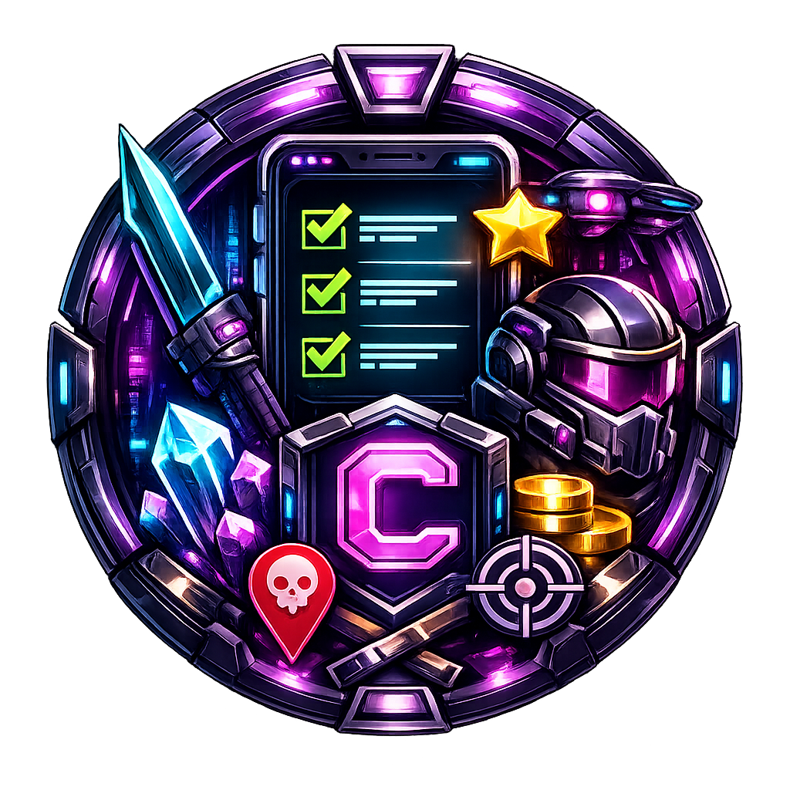

<h1 align="center">Checkpoint</h1>
<h3 align="center">Trabajo Final de Grado – 2º DAM</h3>

<p align="center">
  
</p>

<p align="center">Angular · Spring Boot · Java · MySQL · Docker · AWS</p>

---

## Índice

1. [Descripción del proyecto](#1-descripción-del-proyecto)
2. [Estado del proyecto](#2-estado-del-proyecto)
3. [Funcionalidades principales](#3-funcionalidades-principales)
4. [Acceso al proyecto](#4-acceso-al-proyecto)
5. [Tecnologías utilizadas](#5-tecnologías-utilizadas)
6. [Arquitectura del proyecto](#6-arquitectura-del-proyecto)
7. [Requisitos previos](#7-requisitos-previos)
8. [Instalación y ejecución](#8-instalación-y-ejecución)
9. [Documentación](#9-documentación)
10. [Desarrolladoras](#10-desarrolladoras)
11. [Licencia](#11-licencia)

---

## 1. Descripción del proyecto

Checkpoint es una aplicación web full stack de gestión de tareas con estética futurista basada en el RPG. Su nombre viene de 'Punto de Control', haciendo alusión a los puntos de guardado de los videojuegos.
En lugar de una lista de tareas estándar, el usuario crea un perfil de jugador y completa tareas transformadas en misiones que otorgan puntos de experiencia (XP) y desbloquean logros, como si se tratara de un juego.

Cada perfil tiene sus propias misiones, que pueden organizarse por categorías. Los títulos de nivel están adaptados al género del perfil y los logros se desbloquean automáticamente al llegar a ciertos hitos.

El proyecto está desarrollado con Angular en el frontend y Spring Boot en el backend, comunicados a través de una API REST, con base de datos MySQL y desplegado en AWS.
---

## 2. Estado del proyecto

Completado como Trabajo Final de Grado de 2º DAM.

---

## 3. Funcionalidades principales

La aplicación soporta múltiples perfiles de jugador. Cada perfil tiene sus propias misiones, su propio XP y sus propios logros: los datos no se comparten entre perfiles. No hay sistema de login; en su lugar, al abrir la aplicación se selecciona el perfil con el que se quiere jugar, y todo lo que se hace en esa sesión queda asociado a ese perfil. Al crear uno nuevo, el sistema genera automáticamente tres misiones de bienvenida para que el usuario pueda empezar a explorar la aplicación desde el primer momento.

Las misiones se pueden crear de dos formas. La primera es manual: desde un formulario con validaciones donde el usuario define el nombre, la descripción, la categoría y los xp a recibir.
La segunda es mediante el **Oráculo**, una funcionalidad que llama a una API externa para obtener una tarea aleatoria en inglés y la traduce automáticamente al español, generando así una misión lista para completar sin tener que pensar en qué escribir.

El sistema de niveles y progreso funciona en el frontend: cada misión completada otorga una cantidad de XP según su dificultad, y ese XP acumulado determina el nivel del jugador. Los títulos de nivel no son genéricos; se adaptan al género configurado en el perfil, así que la experiencia es distinta según si el jugador es masculino o femenino. Además, al alcanzar ciertos logros (como completar un número determinado de misiones o llegar a x puntos) se desbloquean logros que quedan registrados en el perfil.

Las misiones también se pueden editar una vez creadas, revertir a estado pendiente si se completaron por error, clasificar por categorías (cada una con su propio icono y color) y marcar como favoritas para filtrarlas fácilmente.

Toda la API está documentada y accesible desde Swagger UI.

---

## 4. Acceso al proyecto

- Repositorio: https://github.com/AlbaBer15/Checkpoint-proyecto-Angular
- Frontend desplegado (AWS S3): http://checkpoint-frontend.s3-website-us-east-1.amazonaws.com
- Backend desplegado (AWS EC2): http://3.221.75.194:8080
- Swagger UI: http://3.221.75.194:8080/swagger-ui/index.html

---

## 5. Tecnologías utilizadas

**Frontend**

Angular 20 con TypeScript y componentes standalone. Para la comunicación con el backend se usa `HttpClient` y de RxJS. 
Los tests están realizados con Jasmine y con Karma. 
Al proyecto en el frontend se configuro Prettier como formateador de código compartido entre las dos desarrolladoras para mantener código limpio y alineado.

**Backend**

Spring Boot 3.2.5 con Java 17. 
Usamos Spring Data JPA con Hibernate sobre MySQL. 
Spring Security gestiona la configuración CORS. 
Lombok reduce el código repetitivo en las entidades y DTOs. 
La documentación de la API se genera automáticamente con Springdoc OpenAPI (Swagger).
Los tests unitarios y de integración usan JUnit 5 y Mockito.

**Infraestructura**

En local la base de datos corre en MySQL 8 en el puerto 3306. Se levanta mediante Docker: el comando docker run descarga la imagen oficial de MySQL, crea el contenedor con la base de datos checkpoint ya configurada y lo arranca en un solo paso.
En producción el proyecto está desplegado en tres servicios de AWS: el backend corre en una instancia EC2, la base de datos MySQL está gestionada por RDS y el frontend está alojado como sitio estático en un bucket S3.

---

## 6. Arquitectura del proyecto

El proyecto está dividido en dos módulos independientes dentro del mismo repositorio.

**Frontend** — la carpeta `front/src/app` está organizada en tres bloques: `features` con las vistas principales (home, missions, achievements), `services` con los servicios que se comunican con el backend y `shared` con los componentes reutilizables como `MissionCard` y el pipe `LevelPipe`

**Backend** — arquitectura en capas: `controller` expone los endpoints REST, `service` contiene la lógica de negocio, `entity` define las entidades JPA, `repository` gestiona el acceso a la base de datos, `dto` agrupa los objetos de transferencia, `config` incluye la configuración e inicialización, `security` gestiona CORS y `exception` centraliza el manejo de errores.

---

## 7. Requisitos previos

Para ejecutar el proyecto en local necesitas tener instalado Node.js 18 o superior, Angular CLI, Java 17 y Maven. 
Para la base de datos necesitas Docker o un servidor MySQL 8 local.

---

## 8. Instalación y ejecución

**Base de datos**

```bash
docker run --name checkpoint-db -e MYSQL_ROOT_PASSWORD=root -e MYSQL_DATABASE=checkpoint -p 3306:3306 -d mysql:8
```

**Backend**

```bash
cd back/backend
mvn spring-boot:run
```
Arranca en `http://localhost:8080`. 
Swagger disponible en `http://localhost:8080/swagger-ui/index.html`.

**Frontend**

```bash
cd front
npm install
ng serve
```
Arranca en `http://localhost:4200`.

---

## 9. Documentación

Los manuales del proyecto se encuentran en la carpeta [`manuales/`](manuales/):

- [`manualUsuario.pdf`](manuales/manualUsuario.pdf) — Guía de uso de la aplicación: perfiles, misiones, logros y funcionalidades.
- [`manualAdmin.pdf`](manuales/manualAdmin.pdf) — Instrucciones detalladas para instalar y desplegar el proyecto en local y en producción.

---

## 10. Desarrolladoras

Proyecto desarrollado por **Alba Bernal** y **Sonia Kendil** como Trabajo Final de Grado del ciclo de 2º DESARROLLO DE APLICACIONES MULTIPLATAFORMA(DAM) en IES Cañaveral, curso 2025/2026.

- Alba Bernal – https://github.com/AlbaBer15
- Sonia Kendil – https://github.com/soniak05

---

## 11. Licencia

Proyecto de uso educativo desarrollado como Trabajo Final de Grado.
